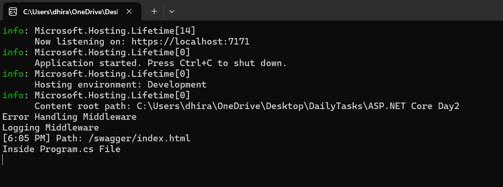

# Middleware Implementation in .NET Web API  

## Project Overview  
This project demonstrates the implementation of multiple middleware components in a .NET Web API application. It includes:  

1. **Custom Middleware:**  
   - Logging middleware to log requests and responses in the console.  
   - Error-handling middleware using `try-catch` to catch and handle exceptions.  
2. **Inline Middleware:**  
   - Middleware created directly in `Program.cs` using `Run` and `Use` methods.  
3. **CORS Middleware:**  
   - Configuring `.NET`'s `UseCors` middleware with settings read from `appsettings.json`.  
4. **Additional Middleware:**  
   - Exploring and utilizing other .NET-provided middleware.  

---

### Output 
