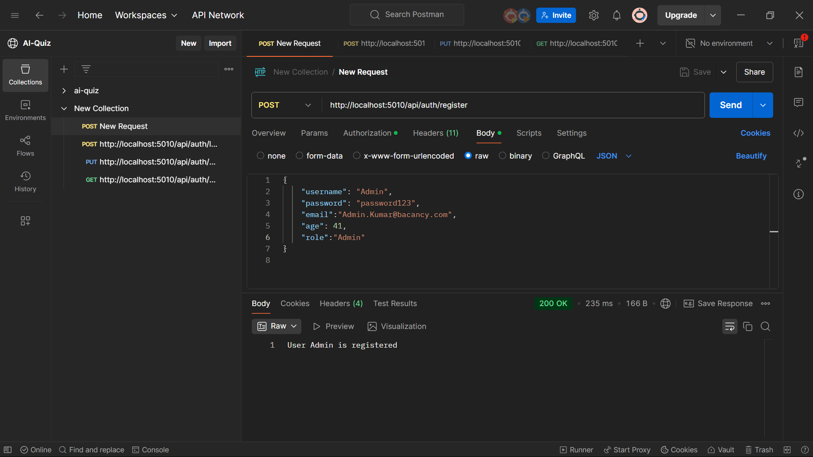
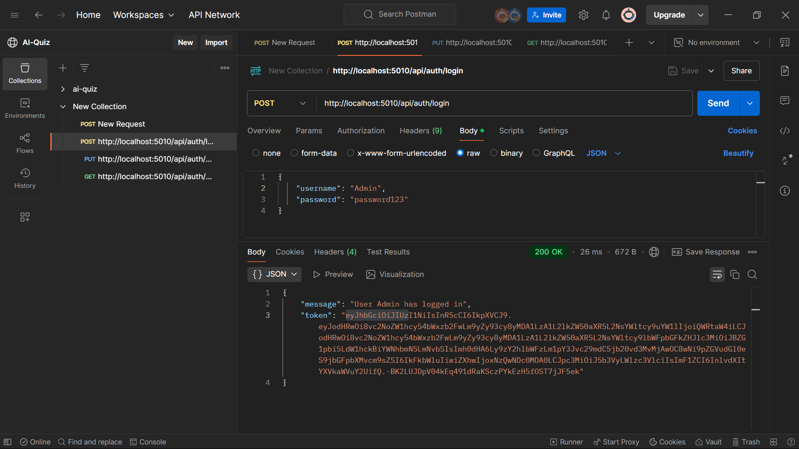
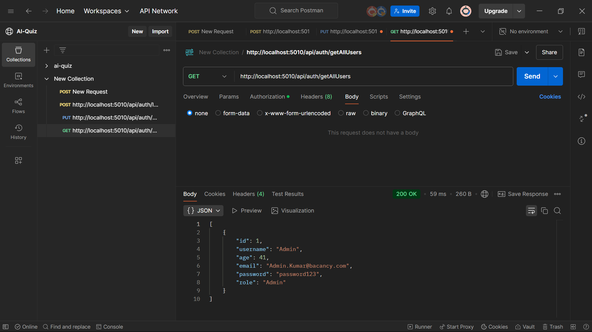
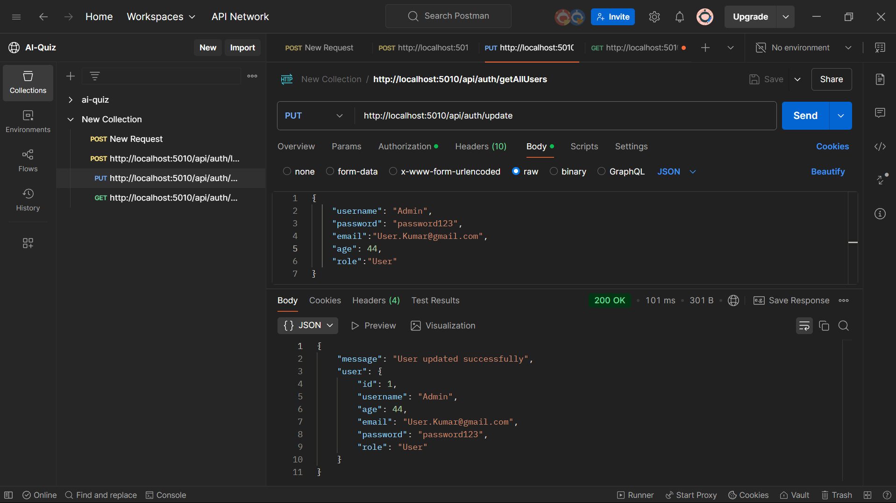
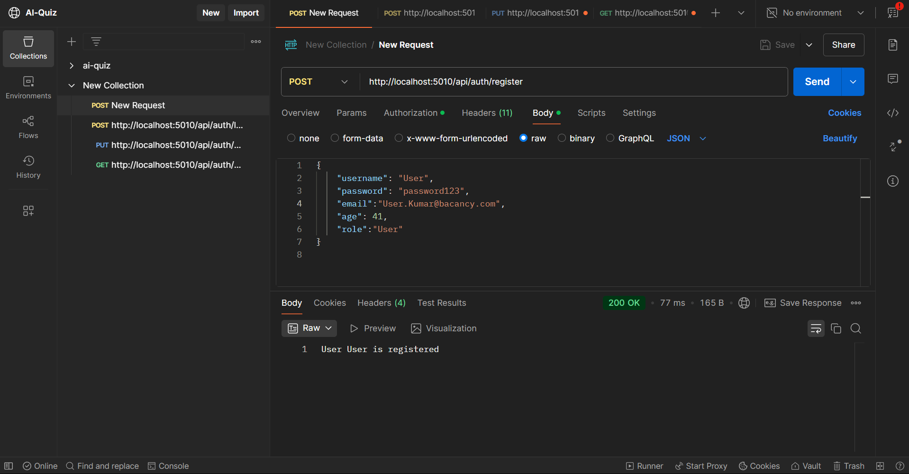
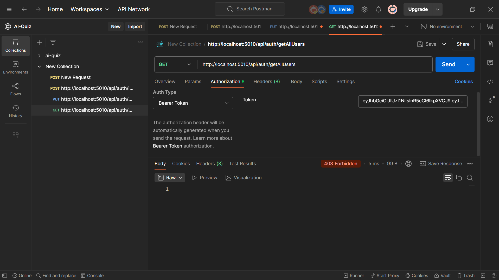

# JWT-based User Management API

This is a **User Management API** built with **.NET Core** that supports user authentication and authorization using **JWT (JSON Web Token)**. The API allows users to register, log in, update their details, and retrieve user information with role-based access control.

## Features

- **User Registration**
- **User Login with JWT Authentication**
- **Role-Based Access Control (RBAC)**
- **Update User Details**
- **Retrieve All Users (Admin Only)**

## API Endpoints

### 1. User Registration

**Endpoint:** `POST /api/auth/register`

**Request Body:**

```json
{
  "username": "john_doe",
  "password": "securePassword123",
  "email": "john@example.com",
  "age": 25,
  "role": "User"
}
```

**Response:**

```json
"User john_doe is registered"
```

### 2. User Login

**Endpoint:** `POST /api/auth/login`

**Request Body:**

```json
{
  "username": "john_doe",
  "password": "securePassword123"
}
```

**Response:**

```json
{
  "Message": "User john_doe has logged in",
  "Token": "your-generated-jwt-token"
}
```

### 3. Update User (Authenticated Users Only)

**Endpoint:** `PUT /api/auth/update`

**Headers:**

```
Authorization: Bearer <JWT-TOKEN>
```

**Request Body:**

```json
{
  "username": "john_doe",
  "email": "new_email@example.com",
  "age": 30,
  "role": "User"
}
```

**Response:**

```json
{
  "message": "User updated successfully",
  "user": {
    "username": "john_doe",
    "email": "new_email@example.com",
    "age": 30,
    "role": "User"
  }
}
```

### 4. Get All Users (Admin Only)

**Endpoint:** `GET /api/auth/getAllUsers`

**Headers:**

```
Authorization: Bearer <JWT-TOKEN>
```

**Response:**

```json
[
  {
    "id": 1,
    "username": "admin",
    "email": "admin@example.com",
    "age": 40,
    "role": "Admin"
  },
  {
    "id": 2,
    "username": "john_doe",
    "email": "john@example.com",
    "age": 30,
    "role": "User"
  }
]
```

## Output 

### Creating Admin


### Loging-In  Admin


### Getting All user from Admin


### Updating Admin


---

### Creating User


### Accesing Api that User is not allowed
