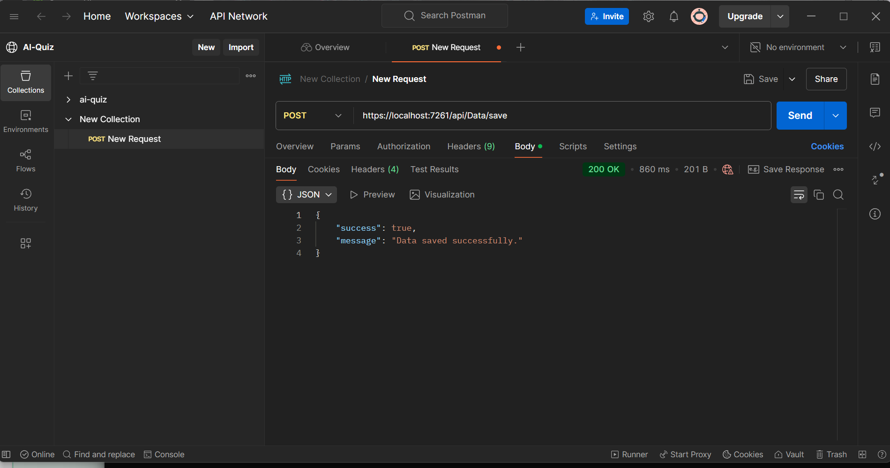
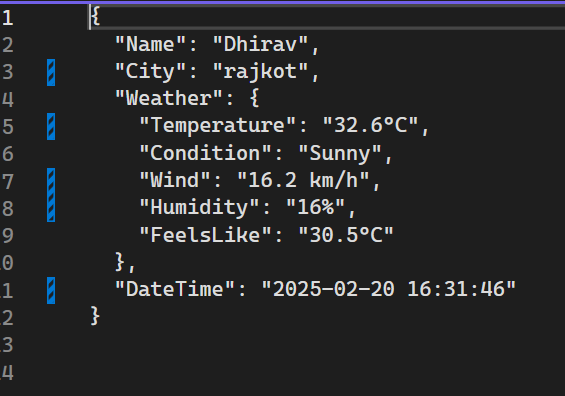
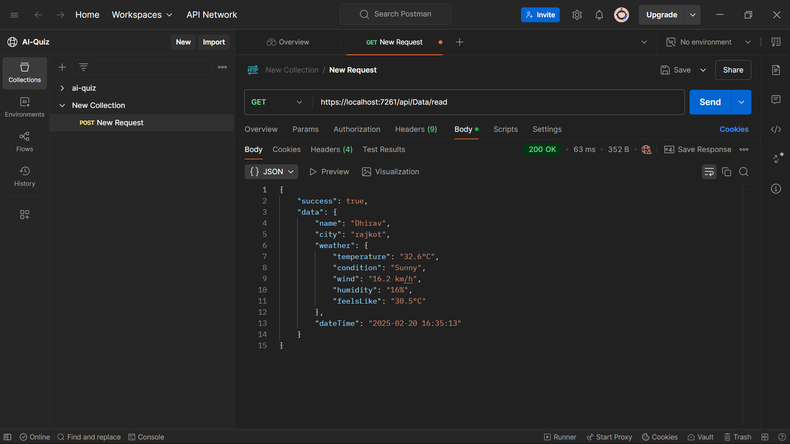
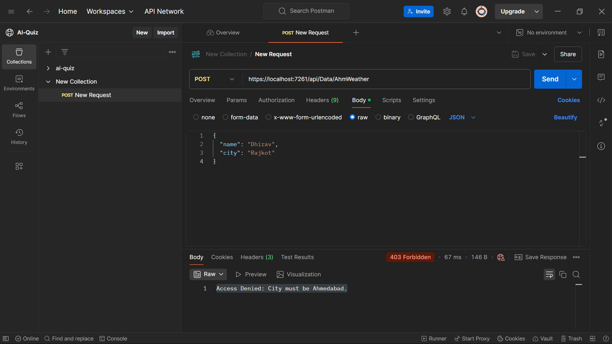
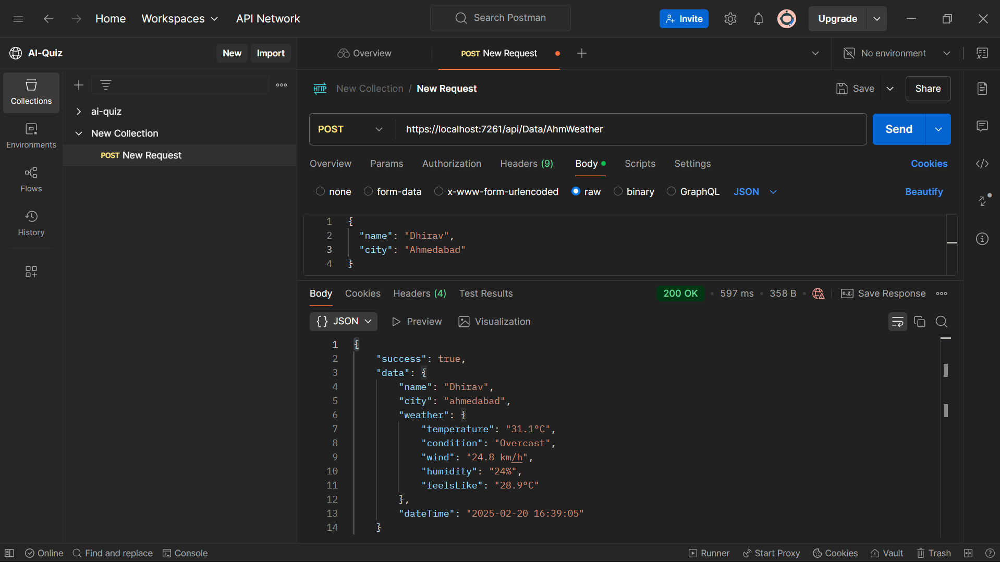
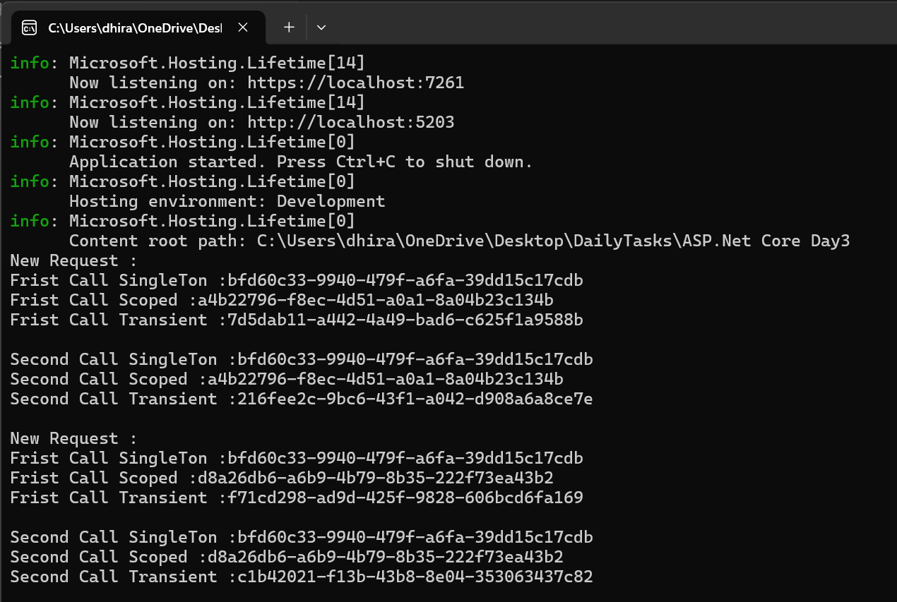

# City Weather Api 

### Saving the data for city entred inside text file

### Output

---

### Reading data from text file

---

### Fetching weather details of rajkot which will be blocked by middleware

### Fetching weather details of ahmedabad which only will be allowed by middleware

---

### Retrieving GUIDs from Singleton, Transient and Scoped Services by dependency injection(DI)

