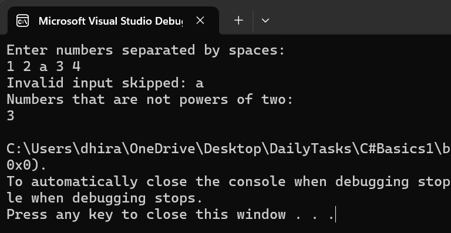
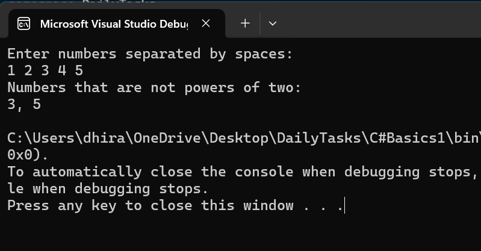

# **PowerOfTwoChecker**  
A simple C# console application that checks whether the given numbers are powers of two. It also handles invalid inputs and ensures a smooth user experience.  

## **📌 Features**  
✅ Accepts space-separated numbers from user input.  
✅ Filters and displays numbers **that are NOT powers of two**.  
✅ Skips **invalid (non-numeric) inputs** gracefully.  
✅ Provides clear output messages.  

---

## **📌 Outputs**  

### ✅ **Case 1: All Numbers Are Powers of Two**  

### ❌ **Case 2: Invalid Characters in Input**  
  