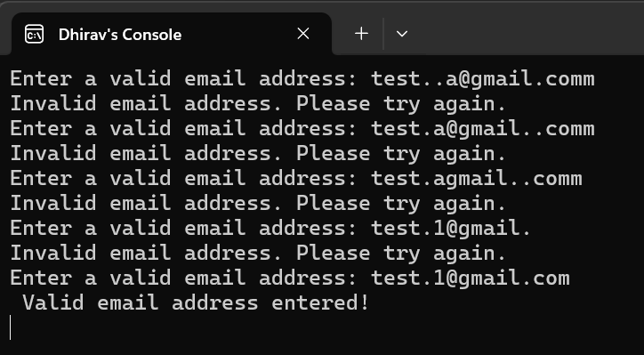

# **Email Validation Program**  

## **Description**  
This C# program validates user-input email addresses using a **regular expression (Regex)**. It ensures that the email format is correct and prevents invalid patterns like consecutive dots, missing domains, or incorrect characters.  

## **Features**  
✅ Checks for valid email format  
✅ Prevents consecutive dots (`..`)  
✅ Ensures the email starts and ends correctly  
✅ Re-prompts user until a valid email is entered  

## **Output Snippet**  

