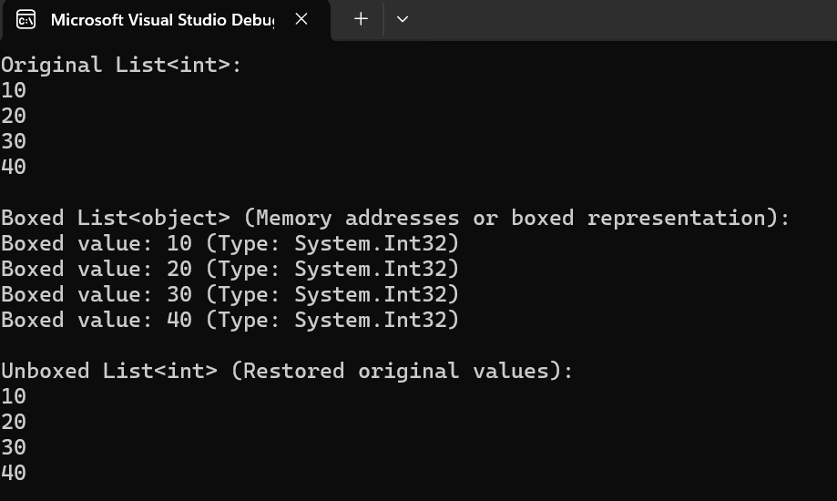

# Box and Unbox Values in C#  

## Overview  
This C# program demonstrates **boxing and unboxing** using generics and collections. It stores value types (like `int`, `double`, and `char`) in a `List<T>`, boxes them into a `List<object>`, and then unboxes them back to their original type.  

## How It Works  
1. A `List<T>` is created with sample values.  
2. Values are **boxed** (converted to `object`) and stored in `List<object>`.  
3. The boxed values are **unboxed** back to their original type.  
4. Results are displayed, showing the difference between original, boxed, and unboxed values.  

## Code Structure  
- **`BoxUnbox` Class**  
  - `BoxValues<T>(List<T>)` → Boxes value types into `List<object>`.  
  - `UnboxValues<T>(List<object>)` → Unboxes objects back to `List<T>`.  
  - `PrintList<T>(List<T>)` → Prints a generic list.  
  - `PrintBoxedList(List<object>)` → Prints boxed values with types.  
- **`Program` Class**  
  - Calls `BoxUnbox` methods to perform boxing, unboxing, and display results.  

## Example Output  
