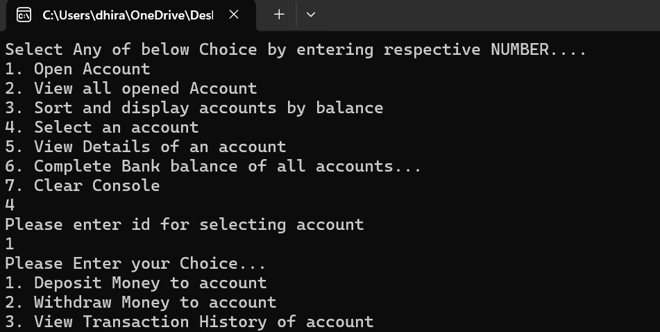

# **Bank Management System (C# Console Application)**  

## **Overview**  
This is a simple **Bank Management System** implemented in C# that allows users to perform essential banking operations such as **creating accounts, managing transactions, viewing account details, and checking the total bank balance**.  

## **Features**  

### **1. Account Management**  
- Create a new bank account (Name, Account Number, Initial Balance).  
- View all opened bank accounts.  
- Search for accounts by name.  
- Sort accounts by balance (Ascending/Descending).  

### **2. Transactions**  
- Deposit money into an account.  
- Withdraw money from an account (with a minimum balance check).  
- View the transaction history of an account.  

### **3. Bank Summary**  
- View details of a specific account (Account Number, Name, Balance).  
- Get the total bank balance (Sum of all account balances).  

## **How It Works**  

### **Main Menu Options**  
1. **Open Account** → Create a new bank account.  
2. **View All Opened Accounts** → Display a list of all bank accounts.  
3. **Sort and Display Accounts by Balance** → Sort accounts in ascending/descending order based on balance.  
4. **Select an Account** → Choose an account for transactions:  
   - Deposit money  
   - Withdraw money (with minimum balance check)  
   - View transaction history  
5. **Search Accounts by Name** → Find accounts matching a name.  
6. **View Total Bank Balance** → Display the sum of all account balances.  
7. **Clear Console** → Clear the console output.  

## **Expected Output Example**  
