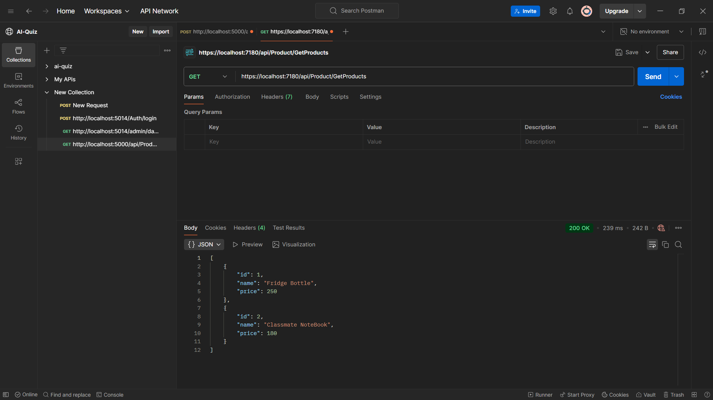
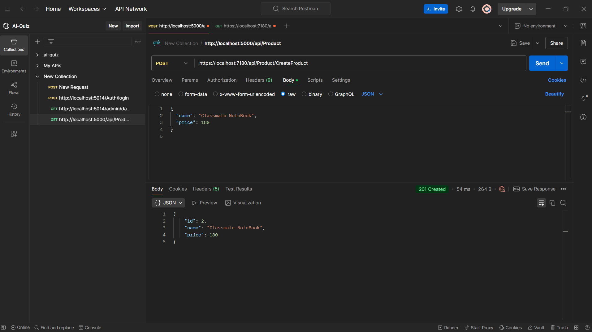

# Standard EF Core Setup (Basic DI Registration)

This project demonstrates the basic setup of **Entity Framework Core (EF Core)** in a **.NET 8 Web API** using **Dependency Injection (DI)**.


## 🎯 Explanation
- **Dependency Injection (DI):** `DbContext` is registered using `AddDbContext<T>()`.
- **Scoped Lifetime:** Ensures a single `DbContext` instance per request.
- **Migrations:** Used to manage database schema changes.
- **Swagger:** Enables API documentation for testing endpoints.


## Endpoints

### 1. Get All Products
#### Endpoint
```
GET /api/Product/GetProducts
```
#### Description
Retrieves a list of all products from the database.

#### Response




---

### 2. Create a Product
#### Endpoint
```
POST /api/Product/CreateProduct
```
#### Description
Adds a new product to the database.

#### Request Body
```json
{
  "name": "New Product",
  "price": 150.0
}
```
#### Response

```


