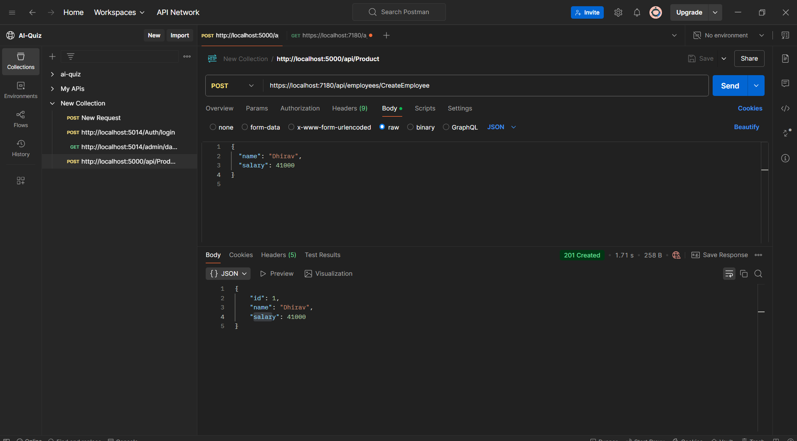

# EF Core Without Dependency Injection (DI) Example

This repository demonstrates how to set up Entity Framework Core `DbContext` using the `OnConfiguring()` method in an ASP.NET Core Web API application **without using Dependency Injection (DI)**.


## API Endpoints

### GET Employees

**Endpoint:** `/api/employees/getemployees`  
**Method:** GET  
**Description:** This endpoint retrieves a list of all employees from the database.

**Sample Request:**

```bash
GET http://localhost:5000/api/employees/getemployees
```


### POST Create Employee

**Endpoint:** `/api/employees/createemployee`  
**Method:** POST  
**Description:** This endpoint allows you to create a new employee record by sending employee data in the request body.

**Sample Request Body:**

```json
{
  "name": "Alice Johnson",
  "position": "HR Manager"
}
```

**Sample Request:**

```bash
POST http://localhost:5000/api/employees/createemployee
```



