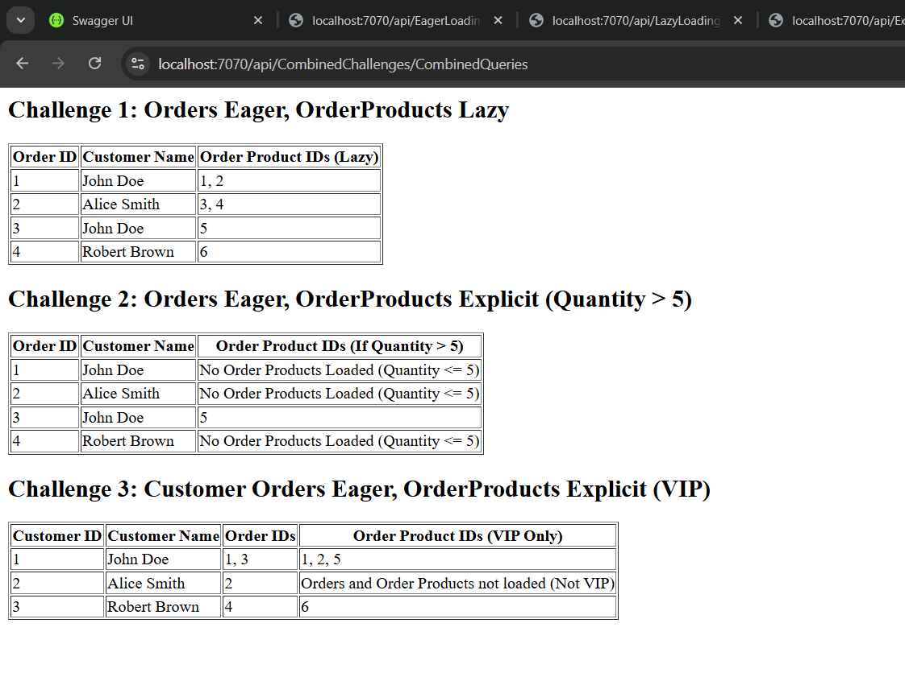
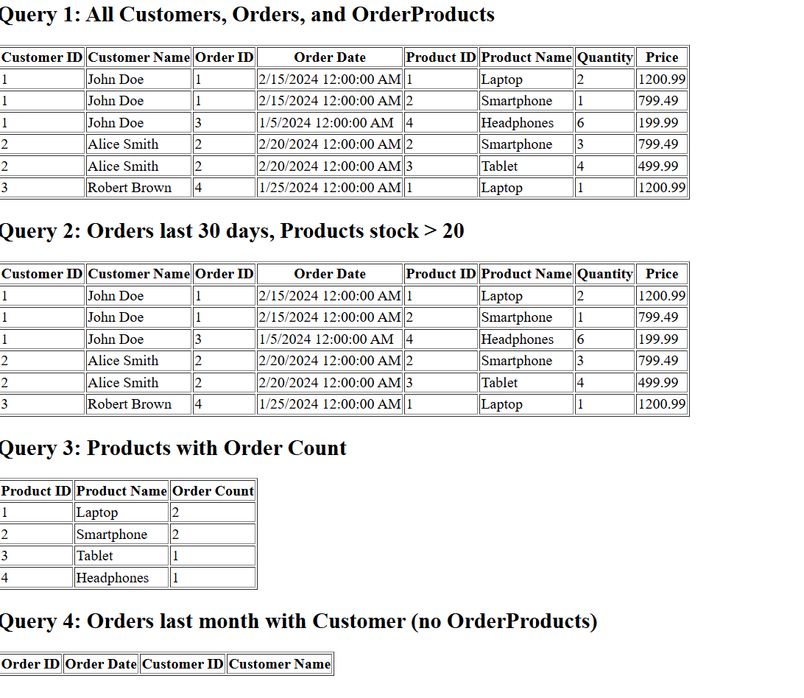
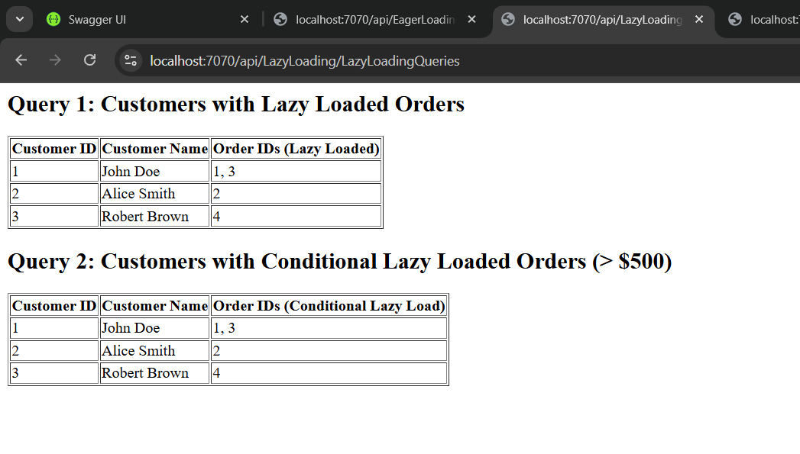
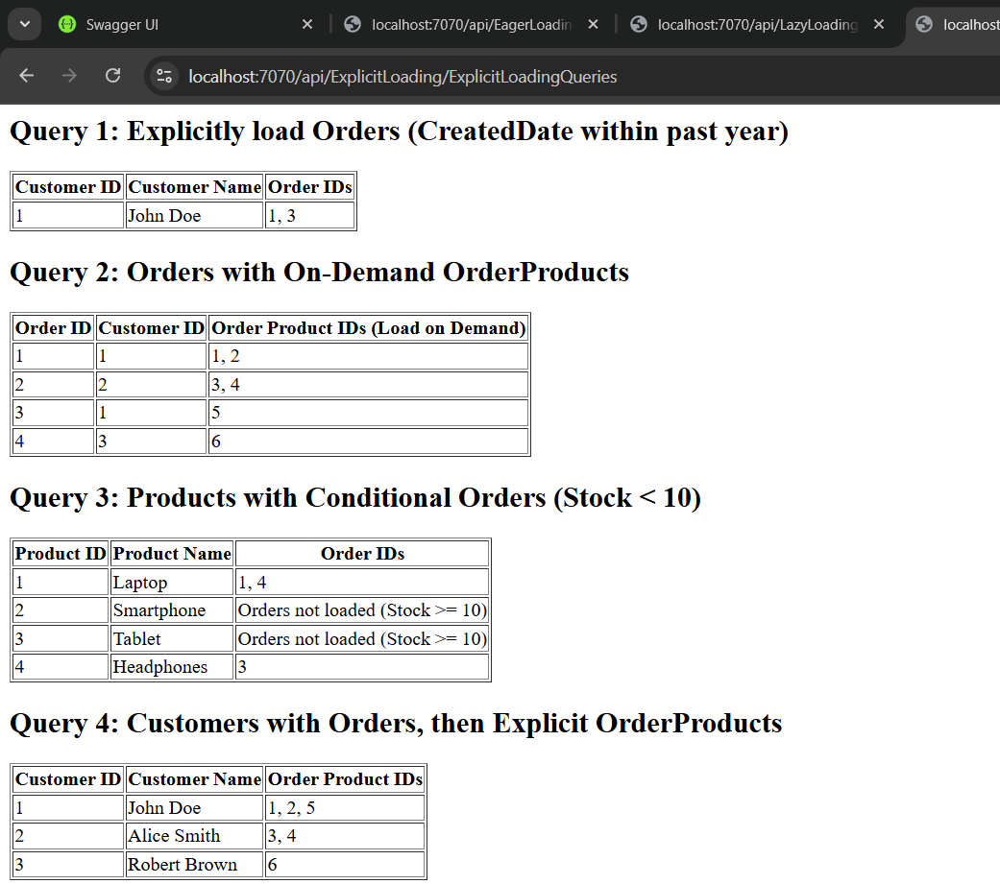

# Entity Framework Core Loading Strategies

## Overview
This project demonstrates different loading strategies in Entity Framework Core, including:
- **Eager Loading**
- **Lazy Loading**
- **Explicit Loading**
- **Combination of Loading Strategies**

Each loading type is implemented in its respective controller, with API endpoints provided for testing. The project also includes **data seeding** with both static and dynamic methods.

---

## Database Schema
### **Tables & Relationships:**
#### **Customer**
- `Id` (Primary Key)
- `Name` (string, required)
- `Email` (string, required, unique)
- `CreatedDate` (DateTime)
- Navigation Property: `Orders` (One-to-Many relationship)

#### **Order**
- `Id` (Primary Key)
- `OrderDate` (DateTime, required)
- `CustomerId` (Foreign Key)
- `IsDeleted` (bool, for soft delete)
- Navigation Properties: `Customer` (Many-to-One), `OrderProducts` (Many-to-Many)

#### **Product**
- `Id` (Primary Key)
- `Name` (string, required)
- `Price` (decimal, required)
- `Stock` (int, required)
- Navigation Property: `OrderProducts` (Many-to-Many relationship)

#### **OrderProduct** (Join Table for Many-to-Many relationship)
- `Id` (Primary Key)
- `OrderId` (Foreign Key)
- `ProductId` (Foreign Key)
- `Quantity` (int, required)
- Navigation Properties: `Order`, `Product`

---

## Data Seeding
The database is pre-populated with sample data:
- **Static Seeding**: Using `HasData()` in `OnModelCreating()` to seed Customers and Products.
- **Dynamic Seeding**: Orders and OrderProducts are dynamically inserted in `ApplicationDbContext` to simulate real-world data.
- Ensures that migrations do **not override existing data** when applied multiple times.

---

## API Endpoints
Each loading strategy is implemented in its own controller.

### **Combined Loading Strategies**
`GET /api/CombinedChallenges/CombinedQueries`
- Demonstrates a combination of eager, lazy, and explicit loading for optimized performance.

### **Eager Loading**
`GET /api/EagerLoading/EagerLoadingQueries`
- Retrieves Customers with their related Orders and OrderProducts in a single query.
- Filters Orders placed in the last 30 days and only includes Products with stock greater than 20.
- Fetches Products along with the total number of Orders they are associated with.
- Retrieves Orders placed in the last month, including Customers but excluding OrderProducts.

### **Lazy Loading**
`GET /api/LazyLoading/LazyLoadingQueries`
- Demonstrates how accessing a navigation property triggers a database query.
- Logs SQL queries to track performance.
- Loads Orders only if their total amount exceeds $500.

### **Explicit Loading**
`GET /api/ExplicitLoading/ExplicitLoadingQueries`
- Retrieves a Customer and explicitly loads their Orders only if their CreatedDate is within the past year.
- Retrieves Orders without related OrderProducts but allows on-demand loading.
- Retrieves Products and conditionally loads their associated Orders if the stock is below 10.
- Fetches Customers eagerly with their Orders, then explicitly loads OrderProducts.
-
---
