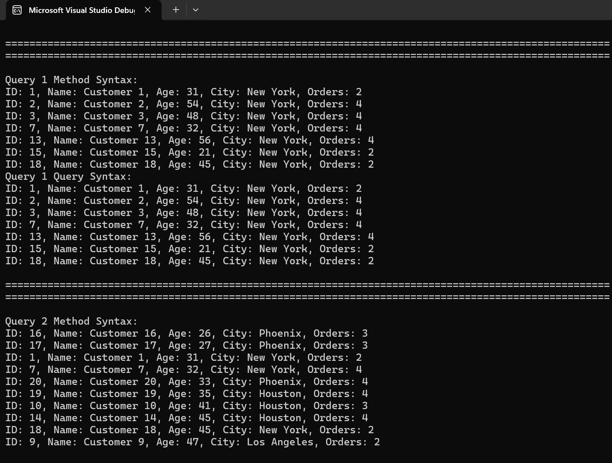
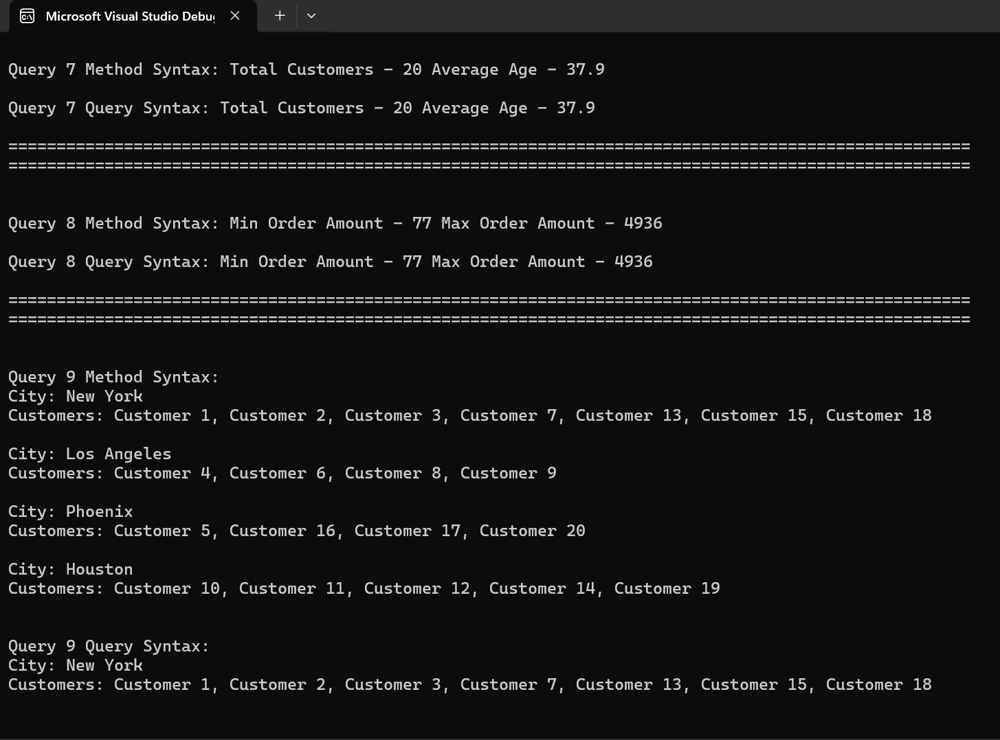

Here’s a well-structured README for your LINQ Day 1 Task:  

---

# LINQ Day 1 - Customer & Order Queries  

## Overview  
This project demonstrates various LINQ queries using both **Method Syntax** and **Query Syntax** to manipulate and retrieve customer and order data.  

## Features  
- **Customer and Order Classes**:  
  - `Customer` class contains properties such as `Id`, `Name`, `Age`, `City`, and a list of `Order` objects.  
  - `Order` class contains properties such as `OrderId`, `Amount`, and `OrderDate`.  
- **Static Data Generation**:  
  - A static list of **20 customers** is generated dynamically.  
  - Each customer has **at least one order** with random values.  
- **LINQ Queries Implemented**:  
  1. Retrieve all customers from "New York".  
  2. Get customers older than 25, sorted by name.  
  3. Fetch all orders of a particular customer, sorted by date.  
  4. Select only `CustomerName` and `City`.  
  5. Retrieve customers along with their order count.  
  6. Use `SelectMany` to get a flat list of all orders.  
  7. Compute total customers and average age.  
  8. Find minimum and maximum order amounts.  
  9. Group customers by city and display names.  
  10. Compute total order amount for each customer.  

## Output

