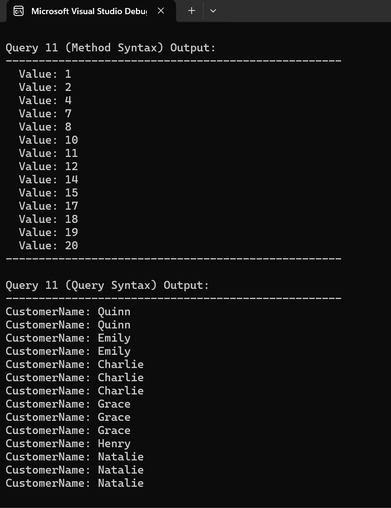

Here's the README file for your LINQ Day 2 Task:

## LINQ Day 2 - Advanced Queries on Customers & Orders  

### Overview  
This project expands on LINQ operations by implementing **advanced queries** using both **Method Syntax** and **Query Syntax**. The focus is on **joining, grouping, filtering, and set operations** on customer and order data.  

### Features & Queries Implemented  

1. **Customers with Orders**  
   - Retrieve only those customers who have placed at least one order.  

2. **Grouped Join (Left Join Equivalent)**  
   - Display each customer along with all their orders. Customers without orders should still appear.  

3. **Cross Join (Cartesian Product)**  
   - Pair every customer with every order, regardless of their relationship.  

4. **Modified Joins (Include All Customers)**  
   - Modify previous queries to return all customers, whether they have orders or not.  

5. **Categorized Orders by Customers**  
   - Show each customer along with a list of their total order amounts.  

6. **Grouping Using `ToLookup` vs. `GroupBy`**  
   - Compare the outputs of `ToLookup` and `GroupBy` for grouping customers and orders.  

7. **Customer Order Statistics**  
   - Return each customer's ID, number of orders placed, and the highest order amount per customer.  

8. **Customers with Orders Over $1000**  
   - Use a **nested LINQ query** to find customers who have placed an order of at least $1000.  

9. **Unique Cities**  
   - List all unique cities where customers are located.  

10. **Set Operations on Customer Lists**  
    - Find customers present in the first dataset but not in the second.  
    - Identify customers who appear in both datasets.  
    - Combine two lists while ensuring there are no duplicate names.  

11. **Removing Duplicates**  
    - Given a list of customer names (with duplicates), remove duplicates using LINQ.  

12. **Lazy vs. Eager Loading**  
    - Implement a simple example demonstrating **lazy evaluation** vs. **eager evaluation** in LINQ queries.  

### Output 
