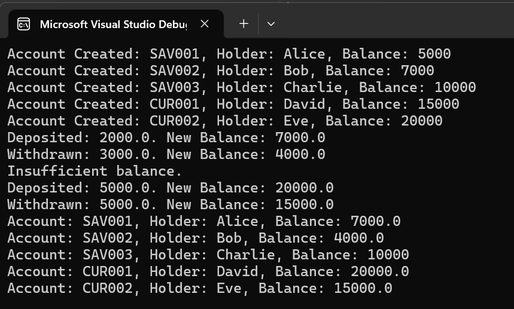

# **Bank Account Management System**  

## **Objective**  
Simulate a **Banking System** using **Object-Oriented Programming (OOP)** concepts in **C#**.

---

## **Features**
- **Encapsulation** to restrict direct balance modification.
- **Parameterized Constructor** for initializing accounts.
- **Destructor** to notify when an account is deleted.
- **Getter & Setter Methods**:
  - `Deposit(decimal amount)`: Adds money to the account.
  - `Withdraw(decimal amount)`: Deducts money while ensuring sufficient balance.
  - `GetBalance()`: Returns the account balance.
- **Transaction Validations**:
  - Prevents negative deposits/withdrawals.
  - Ensures withdrawal does not exceed balance.
- **Multiple Account Types**:
  - **Savings Accounts** (SAV001, SAV002, SAV003)
  - **Current Accounts** (CUR001, CUR002)

---

## **Expected Output**
