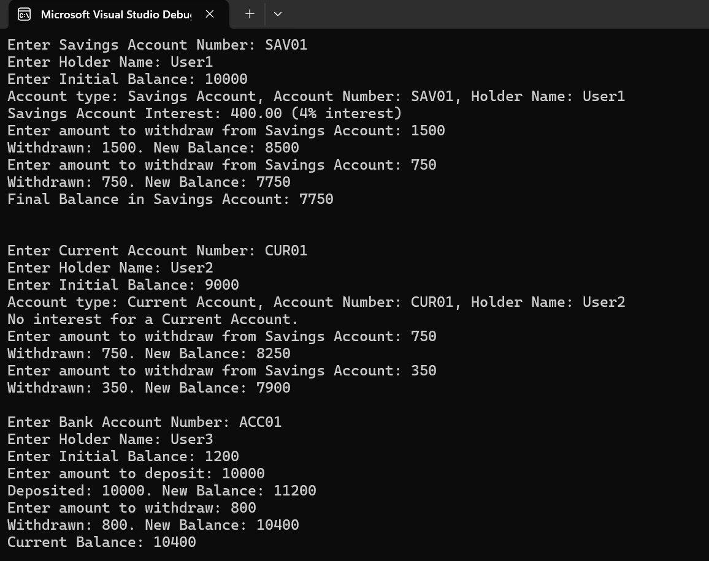

# Bank Account System  

## Overview  
This project demonstrates **Object-Oriented Programming (OOP) concepts** in **C#**, including **inheritance, polymorphism, abstraction, sealed classes, partial classes**, and **explicit interface implementation**.  

## Features  

### 🏦 **Inheritance & Method Overriding**  
- `Account` (Base Class)  
  - Common attributes: `AccountNumber`, `HolderName`, `Balance`.  
  - Virtual method: `CalculateInterest()`.  
- `SavingsAccount` & `CurrentAccount` (Derived Classes)  
  - `SavingsAccount` has interest calculation.  
  - `CurrentAccount` has an overdraft limit.  
  - Uses **base** keyword to initialize fields.  

### 🔄 **Polymorphism**  
- Method Overriding:  
  - `CalculateInterest()` is overridden in `SavingsAccount` & `CurrentAccount`.  
- **Explicit Interface Implementation** with `IBankingOperations`:  
  - `Deposit(decimal amount)`, `Withdraw(decimal amount)`, `GetBalance()`.  

### 🏛️ **Abstraction**  
- **Abstract Class:** `BankServices`  
  - Implements `LoanApprovalStatus()` in `BankAccount`.  
  - Includes `PrintBankDetails()` as a non-abstract method.  
- **Interface:** `IBankingOperations`  
  - Enforces **explicit implementation** in `BankAccount`.  

### 📜 **Sealed Class**  
- `TransactionLogger` (Sealed) logs transactions.  

### 🔗 **Partial Class**  
- `AccountOperations`:  
  - Handles **Deposit() & Withdraw()** in one part.  
  - Handles **CheckBalance()** in another part.  

### Output
