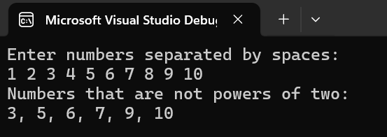
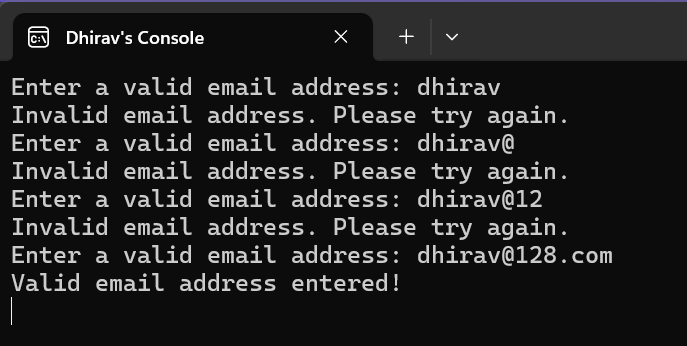

#Daily Tasks

###Task 1 - Check if All Numbers are Powers of Two

###Task 2 - Create a while loop where the program continues to prompt for user input until a valid email address is entered. Validate the input using regex (use a basic regex pattern)

