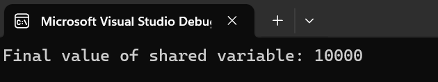

# Daily Tasks

### Task 1 - Check if All Numbers are Powers of Two.

---

### Task 2 - Create a while loop where the program continues to prompt for user input until a valid email address is entered. Validate the input using regex (use a basic regex pattern)

---

### Task 3 - Create a List<T> of value types, then box each value and store it in a List<object>. The program should not only box and unbox a single value type but also use collections (like List<T> or ArrayList) to store both boxed and unboxed values. Also use generic method that works with any value type (like int, double, or char) and boxes and unboxes the value.

---

### Task 4 -  Write a program where multiple threads try to write to the same resource (e.g., increment a shared variable). Use Mutex to ensure that only one thread can access the critical section at a time. Print the value of the shared variable after all threads have completed.

---

