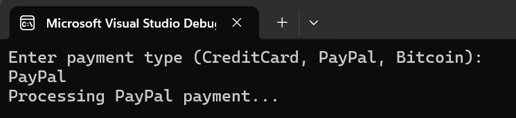

# **Payment Processing System**  

A simple **C# Console Application** implementing the **SOLID principles** for processing payments using different methods (Credit Card, PayPal, Bitcoin).  

## **Features**  
✅ Implements **Interface Segregation (ISP)** and **Dependency Inversion (DIP)**  
✅ Follows **Single Responsibility Principle (SRP)** for modular design  
✅ Uses **Open/Closed Principle (OCP)** for extensibility  
✅ Supports multiple payment methods: **Credit Card, PayPal, Bitcoin**  
✅ Implements **Factory Pattern** for flexible payment processing  

## Output
